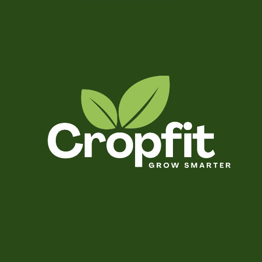

# 📝 Dotly - Modern Notes App

<div align="center">
  
  
  [](https://flutter.dev/)
  [](https://firebase.google.com/)
  [](LICENSE)
  [](https://flutter.dev/)
</div>

## 🌟 About

**Dotly** is a modern, feature-rich Flutter application designed for seamless note-taking and task management. Built with a focus on user experience, it offers a clean interface with powerful features for organizing your thoughts, ideas, and tasks.

## ✨ Features

### 📱 Core Features
- **📝 Smart Note Creation**: Create text notes, todo lists, shopping lists, and voice notes
- **🏷️ Category Organization**: Organize notes into categories (Work, Ideas, To-do, Shopping List, Night thoughts)
- **🔍 Advanced Search**: Search through your notes by title and content
- **☁️ Cloud Sync**: Real-time synchronization with Firebase Firestore
- **🔐 Secure Authentication**: Firebase Authentication with Google Sign-in support
- **📱 Cross-Platform**: Works on Android, iOS, and Web

### 🎨 User Experience
- **Modern UI/UX**: Clean, intuitive interface with beautiful animations
- **Responsive Design**: Optimized for all screen sizes
- **Dark/Light Theme**: Adaptive theming system
- **Smooth Animations**: Engaging micro-interactions and transitions
- **Offline Support**: Works offline with sync when connection is restored

### 🌍 Internationalization
- **Multi-language Support**: English and Hindi localization
- **RTL Support**: Right-to-left text support for various languages
- **Cultural Adaptation**: UI elements adapted for different regions

### 🔧 Technical Features
- **Real-time Updates**: Live synchronization across devices
- **Image Support**: Profile picture upload and management
- **Voice Notes**: Record and store voice memos
- **Export/Share**: Share notes and export functionality
- **Backup & Restore**: Automatic cloud backup with manual restore options

## 🚀 Getting Started

### Prerequisites
- Flutter SDK (3.5.0 or higher)
- Dart SDK (3.0.0 or higher)
- Android Studio / VS Code
- Firebase account

### Installation

1. **Clone the repository**
   ```bash
   git clone https://github.com/ShwetaRajputsk/dotly.git
   cd dotly
   ```

2. **Install dependencies**
   ```bash
   flutter pub get
   ```

3. **Firebase Setup**
   - Create a new Firebase project at [Firebase Console](https://console.firebase.google.com/)
   - Enable Authentication (Email/Password and Google Sign-in)
   - Enable Firestore Database
   - Download `google-services.json` (Android) and `GoogleService-Info.plist` (iOS)
   - Place them in the respective platform folders

4. **Run the app**
   ```bash
   flutter run
   ```

### Platform-Specific Setup

#### Android
- Place `google-services.json` in `android/app/`
- Update `android/app/build.gradle` with Firebase configuration

#### iOS
- Place `GoogleService-Info.plist` in `ios/Runner/`
- Update iOS deployment target in Xcode

#### Web
- Configure Firebase hosting (optional)
- Update Firebase configuration in `web/index.html`

## 📱 Screenshots

<div align="center">
  
  
  
  
</div>

## 🏗️ Project Structure

```
lib/
├── main.dart                 # App entry point and configuration
├── splash_screen.dart        # Splash screen with animations
├── onboardingscreen.dart     # Onboarding flow
├── login.dart               # Login page with Firebase Auth
├── signup.dart              # Signup page
├── home_page.dart           # Main notes interface
├── account.dart             # User account and profile
├── edit_profile.dart        # Profile editing interface
├── custom_app_bar.dart      # Custom app bar component
└── services/
    └── auth_service.dart    # Authentication service
```

## 🛠️ Technology Stack

- **Frontend Framework**: [Flutter](https://flutter.dev/) 3.5+
- **Backend Services**: [Firebase](https://firebase.google.com/)
  - Authentication
  - Firestore Database
  - Cloud Storage
  - Cloud Functions
- **State Management**: Flutter StatefulWidget
- **Localization**: [Easy Localization](https://pub.dev/packages/easy_localization)
- **UI Components**: Material Design 3
- **Additional Packages**:
  - `image_picker` - Image selection
  - `camera` - Camera functionality
  - `shimmer` - Loading animations
  - `share_plus` - Share functionality
  - `url_launcher` - URL handling
  - `webview_flutter` - Web content display

## 🎯 Key Features Explained

### Note Types
- **Text Notes**: Rich text notes with formatting
- **Todo Lists**: Checkable task lists with completion tracking
- **Shopping Lists**: Organized shopping items
- **Voice Notes**: Audio recording and playback

### Categories
- **Work**: Professional notes and tasks
- **Ideas**: Creative thoughts and concepts
- **To-do**: Personal task management
- **Shopping List**: Grocery and shopping items
- **Night thoughts**: Personal reflections

### Search & Filter
- Real-time search across all notes
- Category-based filtering
- Advanced search with multiple criteria

## 🔧 Configuration

### Firebase Configuration
```dart
// Example Firebase configuration
final firebaseOptions = FirebaseOptions(
  apiKey: "your-api-key",
  appId: "your-app-id",
  messagingSenderId: "your-sender-id",
  projectId: "your-project-id",
  storageBucket: "your-storage-bucket",
);
```

### Localization
```dart
// Supported languages
final supportedLocales = [
  Locale('en', 'US'), // English
  Locale('hi', 'IN'), // Hindi
];
```

## 🚀 Deployment

### Android
```bash
flutter build apk --release
flutter build appbundle --release
```

### iOS
```bash
flutter build ios --release
```

### Web
```bash
flutter build web --release
```

## 🤝 Contributing

We welcome contributions! Please follow these steps:

1. Fork the repository
2. Create a feature branch (`git checkout -b feature/AmazingFeature`)
3. Commit your changes (`git commit -m 'Add some AmazingFeature'`)
4. Push to the branch (`git push origin feature/AmazingFeature`)
5. Open a Pull Request

### Development Guidelines
- Follow Flutter coding conventions
- Add tests for new features
- Update documentation for API changes
- Ensure all tests pass before submitting

## 📄 License

This project is licensed under the MIT License - see the [LICENSE](LICENSE) file for details.

## 🙏 Acknowledgments

- [Flutter Team](https://flutter.dev/) for the amazing framework
- [Firebase](https://firebase.google.com/) for backend services
- [Material Design](https://material.io/) for design guidelines
- All contributors and supporters

## 📞 Support

- **Issues**: [GitHub Issues](https://github.com/ShwetaRajputsk/dotly/issues)
- **Discussions**: [GitHub Discussions](https://github.com/ShwetaRajputsk/dotly/discussions)
- **Email**: [Your Email]

## 🔮 Roadmap

- [ ] **Advanced Note Features**
  - Rich text editor
  - Markdown support
  - Image attachments
  - Drawing/sketching

- [ ] **Collaboration**
  - Shared notes
  - Real-time collaboration
  - Comments and annotations

- [ ] **Advanced Organization**
  - Tags system
  - Folders and subfolders
  - Smart collections
  - Archive functionality

- [ ] **Productivity Features**
  - Reminders and notifications
  - Calendar integration
  - Export to various formats
  - Templates

- [ ] **Security & Privacy**
  - End-to-end encryption
  - Biometric authentication
  - Private notes
  - Backup encryption

---

<div align="center">
  <p>Made with ❤️ by <a href="https://github.com/ShwetaRajputsk">Shweta Rajput</a></p>
  <p>⭐ Star this repository if you found it helpful!</p>
</div>
